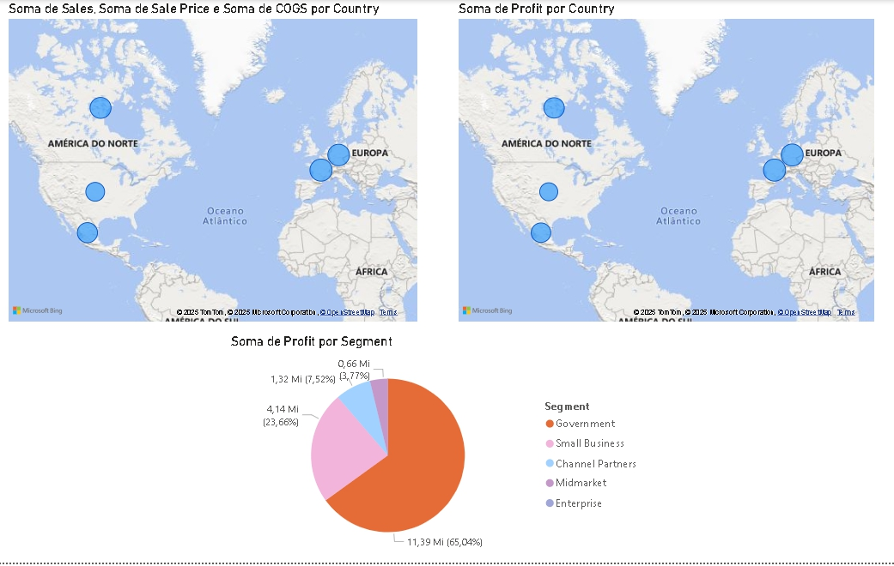

# Desafio de Projeto Power BI - Análise Financeira

Este projeto é a resolução do Desafio de Projeto "Criando um Relatório de Vendas no Power BI", proposto pela [Digital Innovation One (DIO)](https://dio.me/). O objetivo foi aplicar os conceitos aprendidos sobre a ferramenta Power BI para construir um dashboard interativo e informativo a partir de um conjunto de dados financeiros.

## 📊 Dashboard Final

A imagem abaixo apresenta o resultado da terceira página do relatório, que foi criada do zero como parte principal do desafio, focando em análises geográficas e por segmento de mercado.



## 🎯 Descrição do Desafio

O desafio consistiu em replicar duas páginas de um relatório já existentes (desenvolvidas durante o curso) e, em seguida, criar uma terceira página contendo os seguintes visuais:

1.  **Mapa 1:** Análise de vendas e unidades vendidas por país.
2.  **Mapa 2:** Análise do lucro (profit) por país.
3.  **Gráfico de Pizza:** Análise do lucro por segmento de mercado.

Além da criação dos visuais, o desafio incluía a formatação, publicação e compartilhamento do relatório final.

## 🛠️ Ferramentas Utilizadas

- **Power BI Desktop:** Utilizado para a importação, tratamento de dados (Power Query) e criação dos visuais e do dashboard.
- **Microsoft Excel:** Fonte de dados (`financials.xlsx`).
- **Git & GitHub:** Utilizados para o versionamento do código e apresentação do projeto.

## 📝 Etapas do Projeto

1.  **Fork e Clonagem:** O repositório original da expert [Juliana Zanelatto](https://github.com/julianazanelatto) foi "forkado" para dar início ao projeto.
2.  **Obtenção e Carga de Dados:** O conjunto de dados, um arquivo Excel (`financials.xlsx`), foi carregado no Power BI Desktop.
3.  **Criação do Relatório:**
    - As duas primeiras páginas do relatório foram replicadas conforme as aulas do curso.
    - A terceira página foi desenvolvida do zero, adicionando os três visuais solicitados (dois mapas e um gráfico de pizza).
    - Os visuais foram formatados, com títulos claros e dicas de ferramentas configuradas para exibir informações relevantes.
4.  **Publicação:** O relatório final foi publicado no Power BI Service para permitir o compartilhamento online.
5.  **Versionamento:** O arquivo `.pbix` do projeto e um screenshot do resultado foram adicionados a este repositório no GitHub para compor o portfólio.

## 🚀 Como Visualizar o Relatório

Para explorar o relatório interativo, siga os passos abaixo:

1.  **Pré-requisitos:** Você precisará ter o [Power BI Desktop](https://powerbi.microsoft.com/pt-br/desktop/) instalado em seu computador.
2.  **Clone este repositório:**
    ```bash
    git clone [https://github.com/GustavoWillian7/power_bi_analyst.git](https://github.com/GustavoWillian7/power_bi_analyst.git)
    ```
3.  **Abra o arquivo:** Navegue até a pasta do projeto e abra o arquivo `desafioPowerBIAnalyst.pbix` no Power BI Desktop.

## ✨ Autor

Feito por **[Gustavo Willian]**.

[](https://www.linkedin.com/in/gustavo-willian-867605230/)
[](https://github.com/GustavoWillian7)

## 🙏 Agradecimentos

Agradeço à expert **Juliana Zanelatto** pelo material de estudo de alta qualidade e à **DIO** pela oportunidade de desenvolver e demonstrar minhas habilidades.
